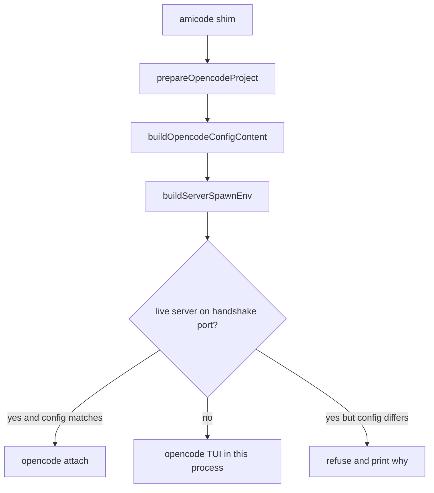

# Amicode CLI, one round at a time

A Codex-shaped client: one command on `PATH`, foreground TUI, current directory is the project. The face is the vendored `opencode` binary. Amicode's job is to assemble the same session the extension assembles in [`packages/extension/src/extension.ts`](../packages/extension/src/extension.ts) and then exec that binary.

`amico` stays the bookkeeping CLI. The new command is `amicode`.

Out of this build: the webview, Run Inspector, device panels, and the extension-host `/amicode/*` service. Chat, skills, vault context, `amicode_*` tools, and `amico-run` solves are in.

## Round 1 — See the asset tree

Add [`packages/amicode-cli`](../packages/amicode-cli) (workspace package, Node, no `vscode` import). Its only job this round is to resolve an asset root and report what is there.

- Dev root: `packages/extension` (override with `AMICODE_ASSET_ROOT`).
- Required files, checked by `amicode doctor`:
  - `vendor/opencode/<platform>/opencode`
  - `opencode-plugin/` as a directory (Bun loads [`amicode_context.ts`](../packages/extension/opencode-plugin/amicode_context.ts) and its sibling imports from disk; do not bundle the plugin)
  - `bin/dist/mcp-amico.mjs`
  - `AGENTS.md`, `scores/`, `packs/`, `skills/`, `templates/`
  - `bin/launcher/amico` and `amico-run` (dev fallback: [`packages/amico-run/launcher`](../packages/amico-run/launcher), same rule as [`resolveAmicoRunBinDir`](../packages/extension/src/opencode_paths.ts))
- `amicode doctor` exits 0 when the tree is complete, non-zero listing each missing path. No config write, no process spawn.

Done when: from the repo, `amicode doctor` prints the root and a pass/fail line per asset.

## Round 2 — Build the session config from the current directory

Call the existing Node prep. Do not copy it.

- [`prepareOpencodeProject`](../packages/extension/src/opencode_config.ts) with `agentsSrc`, `templateSrc` (HP template when [`readSolverModeState`](../packages/extension/src/solver_mode.ts) says `hp`), `workspaceFolders: [cwd]`, and explicit `scoresRoot` / `packsRoot` / skill library root pointing at the asset root.
- Stable project dir: `~/.amico/cli/projects/<hash of cwd>/opencode-project`. This replaces the extension's `storageUri` path. Re-preparing overwrites in place.
- Settings, file only, no VS Code: `~/.amico/cli.json` with optional `juliaProject`, `vaultDir`, `skillRoots`, `defaultModel`. Empty file means the same defaults the extension uses when those settings are unset (`~/.amico/julia`, auto vault stack, bundled skills).
- [`buildOpencodeConfigContent`](../packages/extension/src/opencode_config.ts) today hardcodes the MCP bundle via `__dirname` (`DEFAULT_MCP_DIST_PATH`). Add an explicit MCP path argument so a bundled CLI does not look for `bin/bin/dist/mcp-amico.mjs`. Plugin entry stays the absolute path to `amicode_context.ts`.
- `amicode config` prints the JSON. A test feeds the same inputs the extension config tests use and checks `plugin`, `mcp.amicode`, `instructions`, and `default_agent: "plan"`.

Done when: `amicode config` in a repo prints a config whose plugin and MCP paths exist on disk.

## Round 3 — Build the process environment

Reuse [`buildServerSpawnEnv`](../packages/extension/src/server_auth.ts). The CLI mints `OPENCODE_SERVER_PASSWORD` the same way the extension does for a cold spawn, prepends the `amico` launcher dir to `PATH`, and sets `OPENCODE_DISABLE_EXTERNAL_SKILLS=true` plus the headless plotting vars already in that function.

Also write the setup-state file the context plugin already reads ([`writeSetupStateFile`](../packages/extension/src/setup_state.ts) / the boot call in `extension.ts`), so a missing Julia toolchain surfaces inside the session instead of as a new CLI error.

`amicode env` prints key names only. The password never appears in stdout.

Done when: a unit test asserts `PATH`, `OPENCODE_CONFIG_CONTENT`, and `OPENCODE_SERVER_PASSWORD` are set, and the printed env listing does not contain the password.

## Round 4 — Open the TUI

`amicode` with no subcommand execs the vendored binary in the foreground, cwd = the project directory, env from round 3, no extra args. No args is the TUI; that is what [`terminal.ts`](../packages/extension/src/terminal.ts) already does. Do not daemonize, do not start `opencode serve`, do not start the amicode service.

The process is the session. Quitting the TUI returns to the shell and the server exits with it.

Done when: in this repo, `amicode` opens a TUI that has the plan agent, the context plugin loaded (stderr line `[amicode-context] loaded`), and `amico-run` on the tool `PATH`.

## Round 5 — Do not start a second server

Read [`~/.amico/ops/server/standalone.json`](../packages/extension/src/server_handshake.ts). If the record is valid, the pid is alive, and the config hash matches the JSON from round 2, exec `opencode attach http://127.0.0.1:<port>` with that record's password instead of a new TUI server. If a server is alive but the hash differs, exit with a message naming the conflict (extension session vs this config) and do not spawn. If the record is absent or the pid is dead, fall through to round 4.

Done when: with the extension's server up, `amicode` attaches; with a stale handshake, it says so and does not bind the port.

## Round 6 — Install without the extension

An installer script (next to the package, idempotent) copies one versioned tree to `~/.local/share/amicode/<version>/` and links `~/.local/bin/amicode`.

The tree is the round-1 asset list plus the bundled CLI (`bin/dist/amicode.mjs` and a small launcher). It includes the whole `opencode-plugin/` directory, not a single file. It does not call `code --install-extension`.

`AMICODE_ASSET_ROOT` inside the installed shim points at that tree. Node stays a machine dependency (`node` on `PATH`, the MCP server is `node mcp-amico.mjs`). Julia stays optional at install time.

Done when: from a directory that is not this repo, with the extension uninstalled, `amicode doctor` passes and `amicode` opens the TUI.

## Round 7 — Login, and prove a solve can start

`amicode auth` execs `<vendored opencode> auth login` and returns. Doctor adds three lines that do not change the exit code of a complete asset tree: Node present, provider auth present, Julia project present or "missing — solves will block".

A manual check, not a CI Julia run: in the TUI, ask for a trivial local command so `amico` resolves; confirm a solve attempt names the Julia gap when the project is absent, and reaches `amico-run` when `~/.amico/julia` exists.

Done when: a fresh machine can install, log in, open a project, and either launch a solve or get the existing setup-state message. No editor panels.
